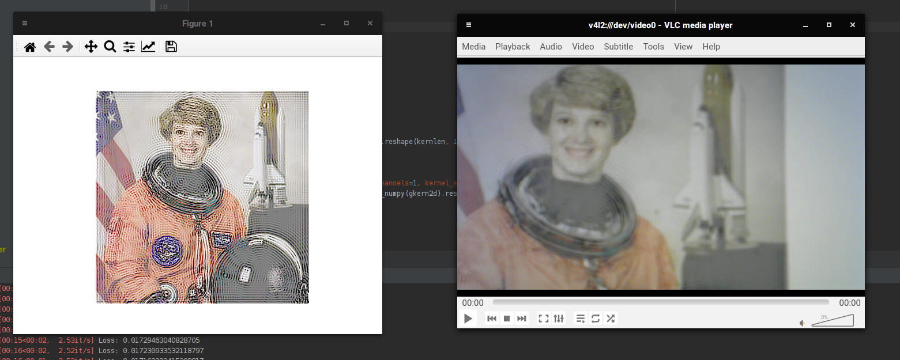
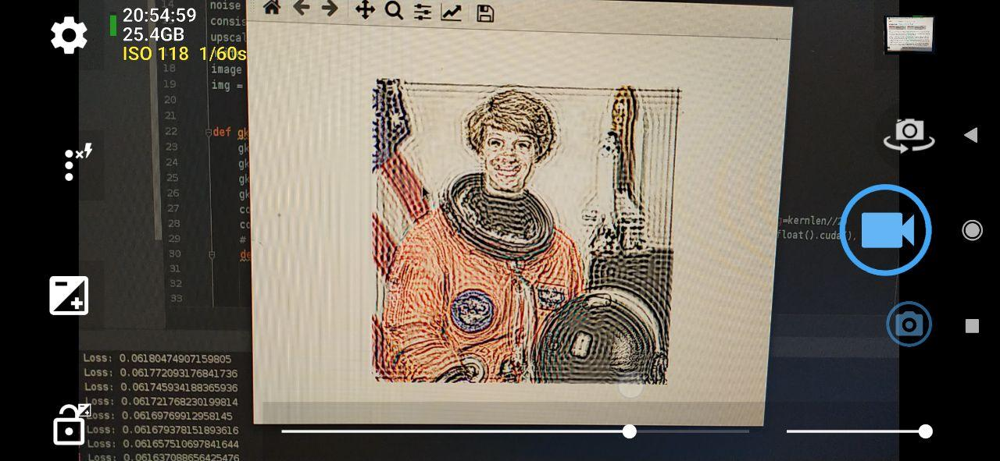

# undefocus
Pre-processing images to correct for defocus blur.

| Source image | Before optimization | After optimization |
| --- | --- | --- |
|  |  |  |

## Why?
When you hold a screen close to your eyes, it becomes blurred.
VR headsets solve this problem by adding lenses that
put the image in focus. I wanted to see whether it's possible to
make a headset without lenses.

## How?
This project uses gradient descent to create the optimal picture to display.
It gradually changes the image so that it retains its quality even when it's blurred.

This algorithm trades off contrast for quality. To reduce the effect of blur, it creates "rings"
around pixels. For best results the rings have to have very high contrast, so the
image is darkened before optimization. When the contrast is still not enough, ringing artifacts
will appear. I found [a paper](https://doi.org/10.1145/2717307) that says this is a fundamental
theoretical limitation and not a shortcoming of this approach.

It's also sensitive to the parameters, and I had to find them separately for my webcam
and phone camera. I couldn't find a parameter set that produced good quality for human observers.

## Future developments
This is a quick-and-dirty sketch with a lot of room for improvement.
The implementation is unoptimized and uses simple gradient descent to find the image.
This process takes a little less than a minute. It could be sped up by training a
neural network to find the target image in a single pass.

The total variation approach from the paper above is another alternative. Their algorithm
runs in a comparable amount of time on a CPU, so it could be several times faster when
ported to the GPU. It's also more stable and supports arbitrary PSFs.

The algorithm could be used in conjunction with a lens instead of doing all the heavy lifting
by itself. It would be able to create varifocal images without changing the hardware.
Alternatively, we could stack LCD layers to create something like a
[Tensor Display](https://web.media.mit.edu/~gordonw/TensorDisplays/). In this way, it
would be possible to create a completely lensless computational varifocal display.

## Implementation details
Defocus blur is approximated with a simple Gaussian filter. There is gamma
correction to account for the physics of light propagation. The image is upsampled 2x
for improved image quality at the cost of speed.

The implementation is written in PyTorch. SSIM loss produces the best results,
but L1 can be used as well. I used a variant of Adam (Adamax) because the optimization
doesn't converge when using anything else.

## How to run
The dependencies are `torch`, `scikit-image` and `matplotlib`. The main file is `undefocus.py`.
CUDA support is hardcoded, but it can be easily changed to run on CPU.

## Parameters
For the webcam (C270):
```
power = 3
sigma = 3
frac = 0.3
```
For the smartphone (Redmi Note 7):
```
power = 2
sigma = 5
frac = 0.4
```

## More examples
Astronaut (C270):



| Source image | Pattern | Result |
| --- | --- | --- |
|  |  |  |
|  |  |  |
|  |  |  |
|  |  |  |
